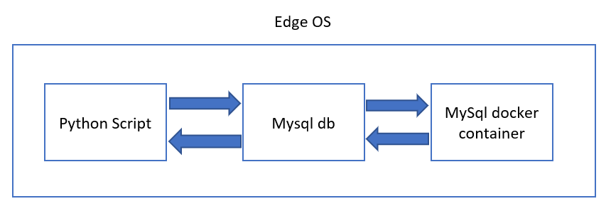

## MySql Database App for Predix Edge

The intent of this app is to allow users to install a MySql Database on the Predix Edge device, allowing MySql database functionality on the Predix Edge with the ability to read, write, and edit the SQL data.

## Use and Database Access

The functionality is extremely simple with the focus being on the fundamentals of constructing the app which communicate to dockerized sqlite. It has two parts

1. Containerizing SQLite database
2. Sample app to access the SQLite database

SQLite is dockerized container application which is deployed through Edge OS. The database is stored in /data/sqlite/ folder. The python application connects to the database and create, insert, query and update the tables. The sample app will be running outside to the container (eg., /mnt/data/downloads/) in EdgeOS.

## Download and Installation

The predix-edge-mysql-20181211-1.0.0.tar.gz can be deployed to your Predix Edge device through PETC or Edge Manager.  Predix Edge will create the data folders and start the mysql Docker container.  After downloading and deploying, the status of the MySql app will go to *Running* in *docker ps* status.

## Architecture

The Sqlite is single-container docker application. As the application is currently configured, its data flow through diagram in seven stages

1. SQLite is dockerized container application is deployed in Edge OS.
2. The SQLite database is stored in /data/sqlite/ folder.
3. The python application connects to the database and create, insert, query and update the tables.
4. The sample app will be running in external to sqlite docker container (e.g., /mnt/data/downloads/) in EdgeOS.
5. The python application will connect through sqlite3 interface.
6. The sqlite3 connection established to database and SQL queries will be executed .
7. The data is persistent for rebooting the device because the db is placed under /data/sqlite/ folder.



In order to develop and run this sample application you will need python which is pre-installed in Edge OS.


#### docker-compose.yml
App deployment parameters are defined in the **docker-compose.yml** file. This file defines the Docker images used to construct the applicaiton.

#### Dockerfile
The Dockerfile is used to compile your app into a Docker image taht can be run in Predix Edge.

The *docker build* command is used to generate the docker image from the source code of your app. The volume /data/sqlite/ is exposed to store the sqlite3 database. Executing this command from the commandline will create a Docker image named *sqlite* with a version of *1.0.0*.

```bash
docker build -t predixedge/sqlite:<latest-tag-version-here> .
```

If your build machine is behind a proxy you will need to specify the proxies as build arguments. You can pull in the proxy values from the environment variables on your machine.

```bash
docker build --build-arg https_proxy --build-arg no_proxy= --build-arg http_proxy -t predixedge/sqlite:<latest-tag-version-here> .
```

## Create table by sample application script

The below sample script will create tables *my_table_1* and *my_table_2*.

```yaml
import sqlite3

sqlite_file = '/var/lib/edge-agent/app/sqlite/data/test.db'  # name of the sqlite database file
table_name1 = 'my_table_1'  # name of the table to be created
table_name2 = 'my_table_2'  # name of the table to be created
new_field = 'my_1st_column' # name of the column
field_type = 'INTEGER'  # column data type

# Connecting to the database file
conn = sqlite3.connect(sqlite_file)
c = conn.cursor()

# Creating a new SQLite table with 1 column
c.execute('CREATE TABLE {tn} ({nf} {ft})'\
        .format(tn=table_name1, nf=new_field, ft=field_type))

# Creating a second table with 1 column and set it as PRIMARY KEY
# note that PRIMARY KEY column must consist of unique values!
c.execute('CREATE TABLE {tn} ({nf} {ft} PRIMARY KEY)'\
        .format(tn=table_name2, nf=new_field, ft=field_type))

# Committing changes and closing the connection to the database file
conn.commit()
conn.close()
```


## Running the App and Verifying the Data

There are different ways in which you can run your application. For debug reasons, you can run it locally just as you would any other NodeJS application. You can also run it in a local Docker on your machine, or you can deploy your packaged application to a Predix Edge OS VM.

#### Run the App in Edge OS

Deploy the sqlite application through Edge Manager and application will be running in docker container. Check the application status with docker command *docker ps -a*.

Exec into docker container *docker exec -it <container-name> /bin/sh*. This will take the shell prompt to the container. By giving *sqlite3* will give command prompt for sqlite database. In sqlite cli app SQL commands can be executed. The data will be stored in /data/sqlite/<db-name>.

#### Create, insert and query table values through python script

Import sqlite3 interface into python script and create a connection to the /data/sqlite/db-file. Through script execute SQL commands to the database.

## Query table by sample application script

The below sample script will create table *my_table_1* and *insert* 5 records and *query* the table values.

```yaml
import sqlite3

sqlite_file = '/var/lib/edge-agent/app/sqlite/data/test.db'  # name of the sqlite database file
table_name1 = 'my_table_1'  # name of the table to be created
new_field = 'my_1st_column' # name of the column
field_type = 'INTEGER'  # column data type

# Connecting to the database file
conn = sqlite3.connect(sqlite_file)
c = conn.cursor()

# Inserting table items
c.execute('INSERT INTO my_table_1 VALUES (1234)')
c.execute('INSERT INTO my_table_1 VALUES (4321)')
c.execute('INSERT INTO my_table_1 VALUES (2341)')
c.execute('INSERT INTO my_table_1 VALUES (3421)')
c.execute('INSERT INTO my_table_1 VALUES (1423)')


c.execute('SELECT * from my_table_1')
all_tbl_itms = c.fetchall()
print('All entries in database', all_tbl_itms)

# Committing changes and closing the connection to the database file
conn.commit()
conn.close()
```

The created tables can be accessed through docker container *sqlite cli*. Similarly databases which are created through *sqlite cli* can be accessed through python script.

[](https://github.com/PredixDev)
